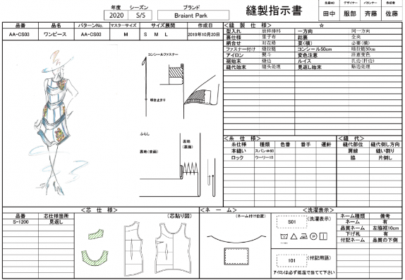

# オリジナルプロダクト

## テーマ

「服や雑貨の企画を効率的に」したい  
「主として個人でブランド運営している人」向けの  
「connect(仮)」という  
「製品管理アプリ」です。

これは「進捗管理から仕様書作成、製品管理への流れがスムーズに」でき、  
「XIFORM」とは違って、  
「進捗管理から製品管理を始める」ことができます。

## ターゲット

個人で服飾雑貨のブランドを運営している知人 A さん

## コンセプト

プロダクトの主目的：

仕様書作成や製品情報管理といった作業を効率化することで、企画デザインや市場調査など本来時間を割くべき仕事に集中できるようにする。

解決したい課題：

- illustrator で仕様書などを作成しているが、表形式の仕様書にはあまり向いていない。項目を増やす時などがやりにくい。
- 仕様書のフォーマットが更新された時の共有がうまくいっていない。更新されたことを忘れて昔のフォーマットを使ってしまったりする。
- 作成した仕様書は共有フォルダに年度やお客様毎に分けて入れているが、検索がしづらく階層も深いため後から目的の仕様書を探すのが大変。また各デザイナーがそれぞれどんなデザインをしているのか確認しにくい。
- 仕様書作成と製品情報登録の作業が分かれており二度手間。
- 各モデルの進捗管理をマネージャーが Excel でしていた。入力が大変だし各デザイナーで共有もしていなかった。

## 実装したい機能

最終的な展望としては、このアプリ一つで、企画から進捗管理、製品情報の登録、サンプル発注、製品発注、検品項目生成、納品、在庫管理等すべて一元管理してあらゆる重複作業をなくしたい。  
ただ今回はコア機能として、進捗管理 → 仕様書作成 → 製品情報管理のみ実装を考えている。

コア機能としてどの機能から実装していくか、A さんと打ち合わせして決めたい！

### 1. 進捗管理

- 各モデルの進捗管理ができる。ガントチャートのようなイメージ。

### 2. 仕様書の作成

- 1 の進捗管理表の情報から仕様書のベースが自動で作られる。

仕様書のイメージ：

### 3. 製品情報管理

- 仕様書に入力した各項目がそのままシステムに登録される。
- 登録された各製品の情報は、品番、お客様名、型などから検索できる。
- 進捗管理表、仕様書、製品情報が連携している。

### 4. 企画をサポートする機能 (今後の追加機能?)

- 企画段階からサポートしたいので、集めた参考画像や今まで作成したデザインラフの管理、共有、マップ作成などの機能もできたら...
- デザイン作成したがサンプル発注までいかずボツになってしまったデザインを死なせないために、共有してどこからでも見られたり検索。

## 既存の類似サービス 「XIFORM」について

アパレル向けデータ管理システム XIFORM。  
情報の管理・共有・活用を行うアパレル向けデータ管理システム。充実した入力補助機能や作図機能がある。

### 基本情報

- ① 帳票入力ソフト「XIFORM MAGIC (サイフォームマジック)」  
  ② 帳票作成ソフト「Layout Maker (レイアウトメーカー)」
  ③ 閲覧ソフト「XIFORM Viewer (サイフォームビューワー)」  
  から成る。
- 導入実績：500 社～
- 金額：
  - 標準契約：初回のみ￥ 165,000, 年間使用料￥ 33,000
  - 1 年契約：￥ 66,000/年
  - クラウドオプション料金：￥ 26,400/年, データベース追加（10GB あたり）￥ 26,400
- YOUTUBE に詳しい使い方解説あり

### できること

- 「レイアウトメーカー」で自由なフォーマットで帳簿が作れて、「サイフォームマジック」でその帳簿に入力・管理ができる。
- 絵型、仕様書、検品書など各帳簿の情報が連携している。例えばデザイナーが絵型を修正すると、すべての帳簿が連動して修正される。
- 図面の作成機能も充実している。
- クラウドサービスであればいつでも・どこからでもアクセスできる。
- CSV ファイルで入出力ができ、様々なシステムとの連携ができる。
- CAD データや汎用ファイルといった様々なデータが簡単に取りこめるので、新たにデータの入力を行う必要がない。
- 進捗管理の機能はないが、別会社のサービス「AYATORI」と連携することで可能になる。各モデルの仕様書に対して、コメントやタスクを作成できる機能。

### できないこと

- 企画段階のこと(画像ファイル管理やマップ作成等)
- ガントチャートのような形での進捗管理

### その他参考サービスメモ

- [AYATORI](https://www.deepvalley.co.jp/ayatori)  
  MD マップの作成や商品管理、生産進捗管理、各種データ集計／抽出などができる。  
  仕様書作成機能はないが、サイフォームと連携して使うことができる。
- [Smart Filing](https://www.a-pros.co.jp/product/fashion/)  
  仕様書作成システム。サイフォームと似た機能。仕様書にある情報を活用し、様々な帳票を同時に作成することが可能。
- [ones closet](https://ones-closet.com/index.html)  
  販売管理／在庫管理。
- [アパレルクラウド](https://www.apparel-cloud.com/)  
  商品・店舗情報・コンテンツ・会員・在庫等、ファッション企業が必要とする全データの一元管理と一括更新。

## 既存サービス(XIFORM)との差別化

### 進捗管理と仕様書を連携。

- XIFORM との主な差別化として、**仕様書作成より前の企画段階からサポート**できるようなサービスにしたい。
- 商品企画でいきなり仕様書は作らない。全体の企画、おおまかにモデル決め、各モデルの試作デザインなど仕様書の前にやることは色々あるので、**その段階の各モデルの進捗管理から製品管理が始められるように**する。

### 機能をシンプルに

- XIFORM には作図機能があるが、独自のこういったツールを習得するまでには時間がかかる。そこで作図機能は付けず、デザインは illustrator に任せてうまく連携することを重視する。
- 大手よりも個人ブランド運営者向けにする。機能が多いと使いこなせなそうで導入を戸惑ってしまう。必要な機能が揃っているが多機能すぎず、操作がシンプルで分かりやすいものにする。

### 個人でも気軽に試しやすい

- 調べた既存サービスたちは大手向けな印象を受ける。機能や値段がぱっと分からず、また多機能なため個人にとってはハードルが高く導入しようという気になれなそう。
- サイトに分かりやすく機能の説明が載っており、その場で機能を試すこともできて導入しやすい。個人でも導入しやすい低料金。
